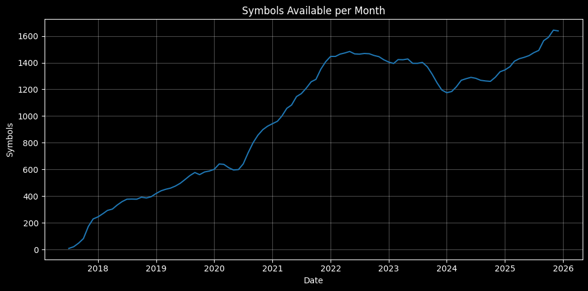
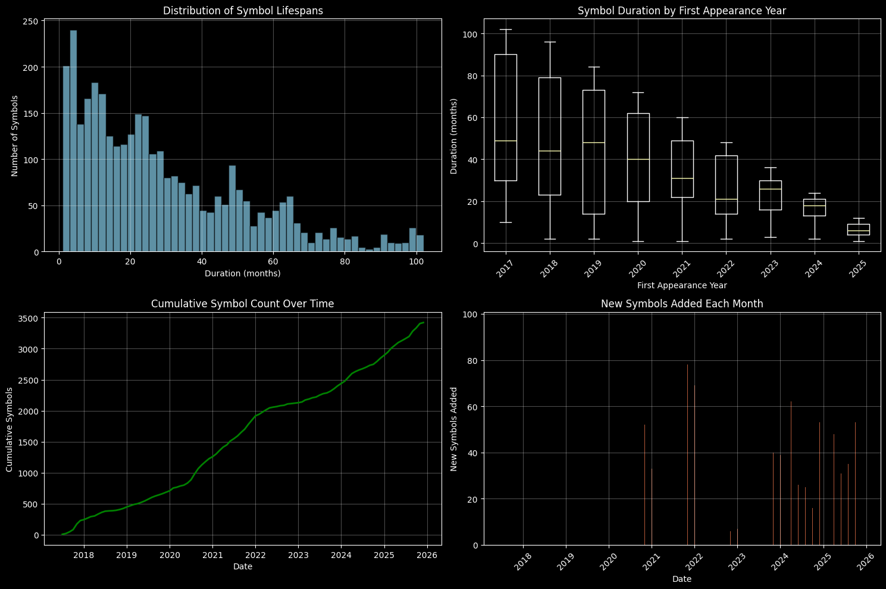

# binance-crypto-klines-data
All of the Binance klines (spot) data up until 2025-12

---

Disregard looking at the -DD in the datetime in YYYY-MM-DD format, as the data is monthly.

Total symbols: 3421

Overall date range: 2017-07-01 00:00:00 to 2025-12-01 00:00:00

| Symbol | Months | First Date | Last Date |
| -------- | -------- | ---------- | --------- |
| ETHBTC | 102 | 2017-07 | 2025-12 |
| NEOBTC | 102 | 2017-07 | 2025-12 |
| LTCBTC | 102 | 2017-07 | 2025-12 |
| BNBBTC | 102 | 2017-07 | 2025-12 |
| QTUMETH | 102 | 2017-07 | 2025-12 |
| GASBTC | 101 | 2017-08 | 2025-12 |
| BNBETH | 101 | 2017-08 | 2025-12 |
| ETHUSDT | 101 | 2017-08 | 2025-12 |
| BTCUSDT | 101 | 2017-08 | 2025-12 |
| LRCETH | 100 | 2017-09 | 2025-12 |

=== TOP 10 LONGEST-RUNNING SYMBOLS ===

| Symbol | Duration | Period |
|--------|----------|---------|
| ETHBTC | 102 months | 2017-07 to 2025-12 |
| NEOBTC | 102 months | 2017-07 to 2025-12 |
| LTCBTC | 102 months | 2017-07 to 2025-12 |
| BNBBTC | 102 months | 2017-07 to 2025-12 |
| QTUMETH | 102 months | 2017-07 to 2025-12 |
| GASBTC | 101 months | 2017-08 to 2025-12 |
| BNBETH | 101 months | 2017-08 to 2025-12 |
| ETHUSDT | 101 months | 2017-08 to 2025-12 |
| BTCUSDT | 101 months | 2017-08 to 2025-12 |
| LRCETH | 100 months | 2017-09 to 2025-12 |

=== MARKET GROWTH PHASES ===

High growth periods (>20% monthly increase): 5

Top growth periods:
- 2017-08: +162.5% (21 symbols)
- 2017-09: +128.6% (48 symbols)
- 2017-11: +111.0% (173 symbols)
- 2017-10: +70.8% (82 symbols)
- 2017-12: +32.4% (229 symbols)

=== DATA QUALITY METRICS ===

- Symbols with data gaps (first 50 checked): 2
- Symbols with most gaps:
    - HSRBTC: 1.0 gap periods out of 14.0 total months
    - YOYOBTC: 1.0 gap periods out of 54.0 total months

=== RECENT ACTIVITY (Last 12 months) ===
- Symbols active in last 12 months: 1878
- Symbols fully active (all 12 months): 1145
- Recent activity rate: 33.5%